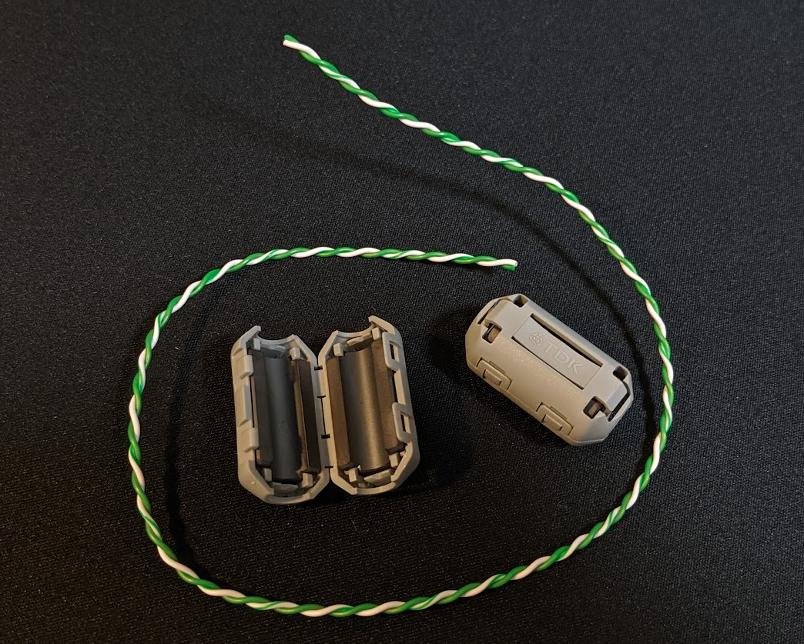
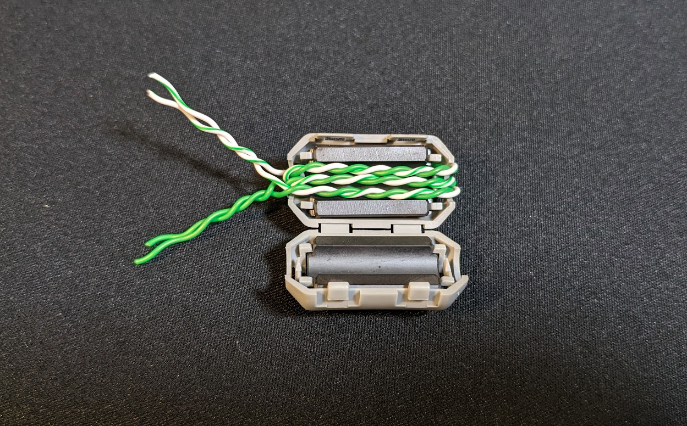
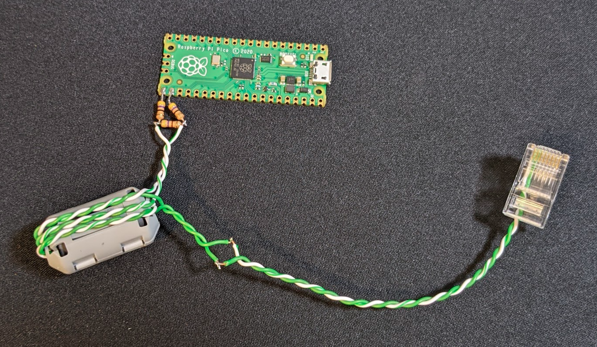
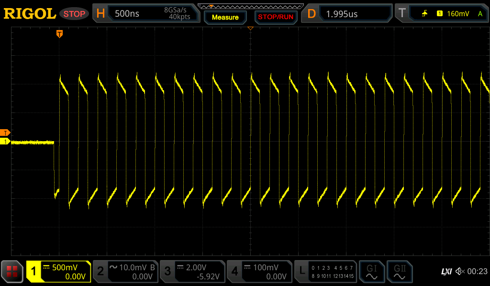
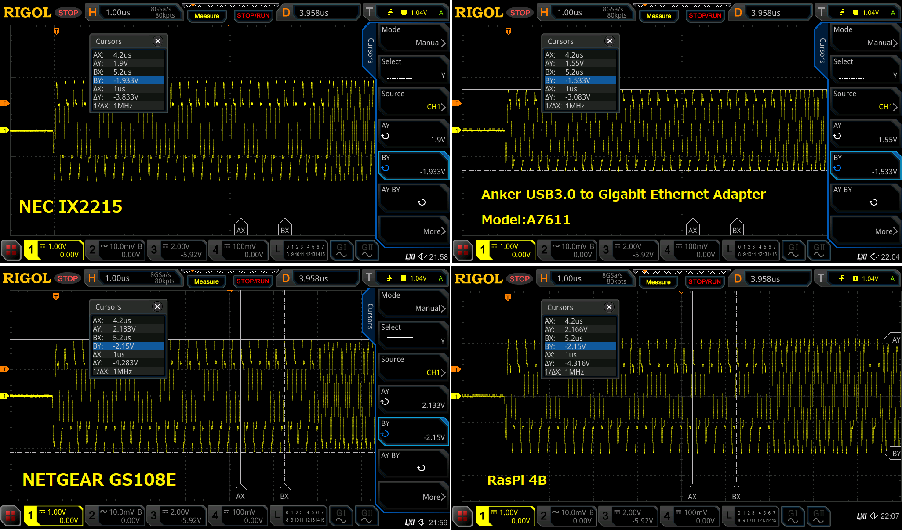
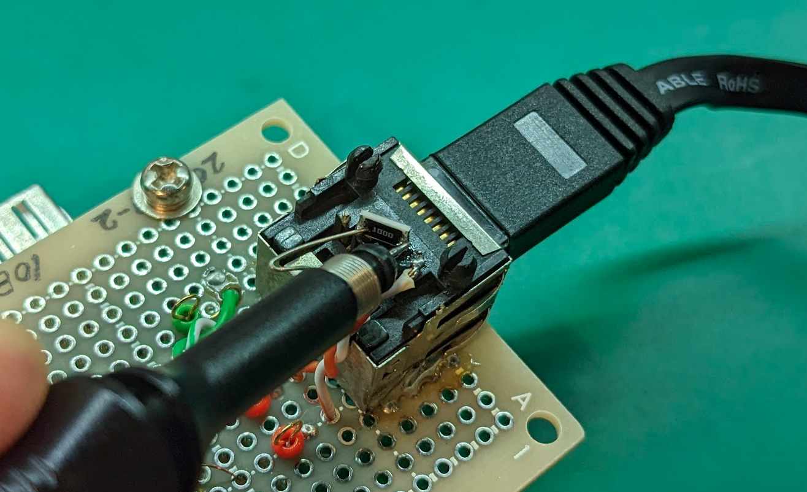

# Pico-10BASE-T
10BASE-T from Raspberry Pi Pico

Note:
* DO NOT CONNECT to PoE equipment!!
* Currently transmission only (UDP is available)
* Receiving process will be implemented in the future...
* It is advisable to insert a pulse transformer for safety.

# Setup
* Raspberry Pi Pico
* 2 x 47 ohm resistor
* 1 x 470 ohm resistor
* RJ45 connector(GP16 = TX-, GP17 = TX+)

Have fun!  
  

# Ethernet Packet Example
  

# Ethernet Physical layer waveform
Measured with 100Ω termination.  

NLP(Normal Link Pulse)  
  

Ethernet Packet overview  
  

Preamble  
  

TP_IDL  
  

# How to make a pulse transformer
A simple pulse transformer can be built using ferrite cores that have fallen around!  
Adding a transformer ensures insulation and safe experimentation.  

  

Pass it through the core about three times.  
  

Just connect it into the RasPico and you're done!  
  

The waveform after passing through the transformer.  
  

# Waveforms of commercial network devices
Physical layer signal waveforms of commercial network equipment operating at 10BASE-T.  
  

Measured with 100Ω termination.  
  

