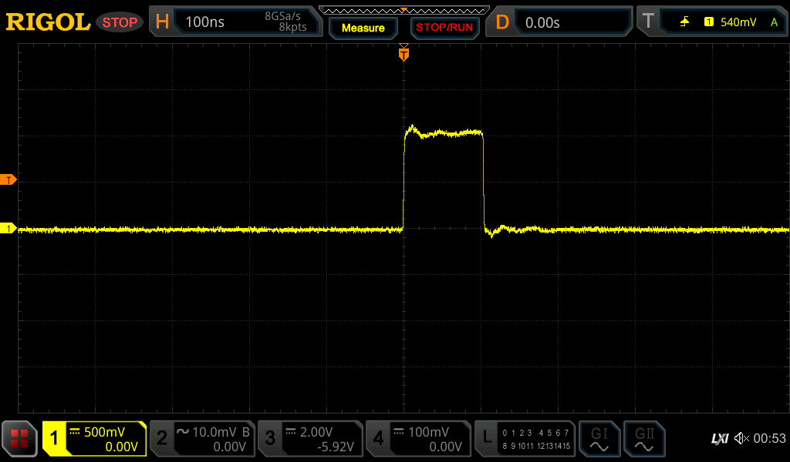

# Pico-10BASE-T
10BASE-T from Raspberry Pi Pico

Note:
* Currently only transmission only (UDP is available)
* Receiving process will be implemented in the future...
* It is advisable to insert a pulse transformer for safety.

# Setup
* Raspberry Pi Pico
* 2 x 47 ohm register
* 1 x 470 ohm register
* RJ45 connector(GP16 = TX-, GP17 = TX+)

Have fun!  
  

# Ethernet Packet Example
  

# Ethernet Physical layer waveform
Measured with 100Ω termination.  

NLP(Normal Link Pulse)  
  

Ethernet Packet overview  
  

Preamble  
  

TP_IDL  
  
